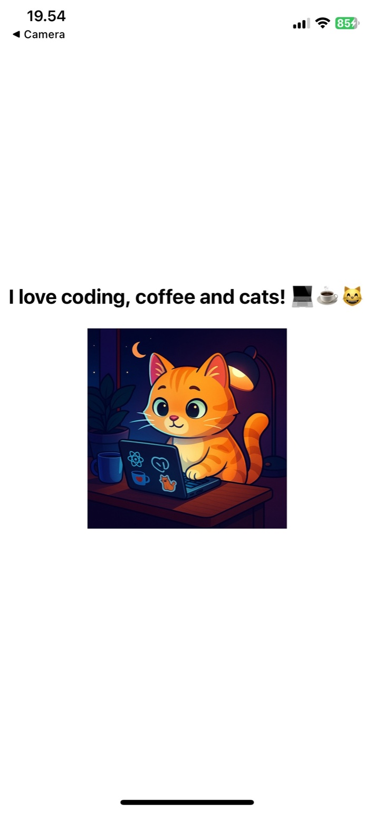
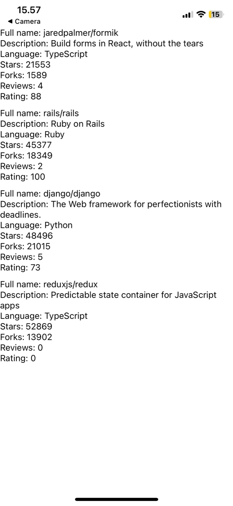
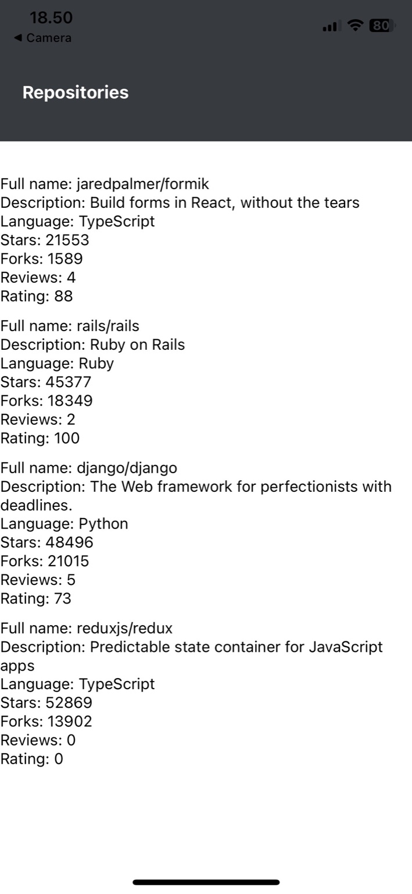

# Rate Repository App (React Native, Full Stack Open Part 10)

This repository contains my solutions for **Part 10 of the Full Stack Open 2025 course (University of Helsinki)**.  
The project is a React Native application developed step by step through the course exercises.

---

## Exercise 10.1: Initializing the application

- Set up the application using the **latest Expo version** (Expo SDK 54, React Native 0.81, React 19).
- In the course material, the teacher used an older SDK (50), but I had difficulties running the app on my phone with Expo Go, so I decided to initialize it with the latest stable version.
- Verified that the app starts with `npm start` and runs successfully on my mobile device with Expo Go.
- Created a **GitHub repository** for the project, as required by the exercise.

**Extra (just for fun):**

- Added a title text: `"I love coding, coffee and cats! 💻☕😸"`
- Inserted an image of a coding cat into the app 🐱💻

### Screenshot

Here is the current look of the app running on my phone:



---

## Exercise 10.2: Setting up ESLint

- Installed **ESLint** and related plugins:  
  `eslint`, `@babel/eslint-parser`, `eslint-plugin-react`, `eslint-plugin-react-native`
- Created a configuration file `.eslintrc.json` with basic React/React Native rules.
- Added a linting script in `package.json`:

  ```json
  "scripts": {
    "lint": "eslint ./src/**/*.{js,jsx} App.js --no-error-on-unmatched-pattern"
  }

  ```

---

## Exercise 10.3: Reviewed repositories list

- Implemented two new components:

  - `RepositoryList` (renders the list using **FlatList**)
  - `RepositoryItem` (renders a single repository’s details)

- Displayed for each repository: **full name, description, language, stars, forks, reviews, rating**.

- Verified that the list renders correctly on mobile.

### Screenshot



---

## Exercise 10.4: The App Bar

- Implemented a new **AppBar** component to display navigation tabs at the top of the app.
- Created a reusable **AppBarTab** component to make it easier to add more tabs in the future.
- Styled the app bar with background color from the `theme` and adjusted padding.
- Updated the **Text** component to support a `light` color variant for white text.
- Integrated the AppBar into **Main.jsx** and removed the old `marginTop` since the app bar now handles status bar spacing.

### Screenshot



---

## Upcoming Exercises

I will keep documenting my progress here for each exercise.
